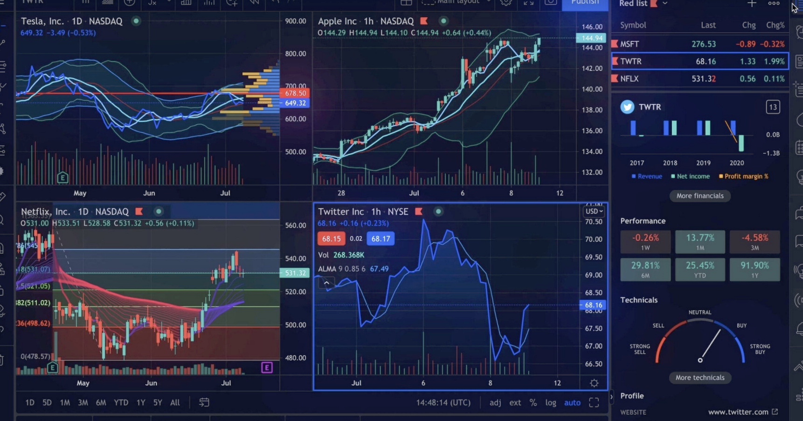

# CRYPTO VIZ



### Description 

CRYPTO VIZ est un projet Big Data qui vise à collecter, traiter et visualiser des données financières liées à des cryptomonnaies. Il utilise des technologies telles que Kafka et Spark pour collecter et analyser en temps réel les données de différentes plateformes de trading de cryptomonnaies

## Project 

Le projet CRYPTO VIZ a pour objectif de fournir une plateforme d'analyse de données de cryptomonnaies en temps réel, offrant une vue détaillée des marchés de cryptomonnaies. 
Les principales fonctionnalités du projet incluent :

- La collecte de données en temps réel à partir de diverses sources de données de cryptomonnaies via des services.
- Le stockage et le traitement efficace de ces données à l'aide de technologies Big Data.
- L'analyse des tendances, la détection de motifs et la génération de statistiques significatives.
- La création de visualisations interactives pour permettre aux utilisateurs de suivre les évolutions des cryptomonnaies.

### Kube

### Services

### Kafka 

kafka-console-consumer.sh --bootstrap-server localhost:9092 --topic datas_binance


kafka-console-consumer.sh --bootstrap-server localhost:9092 --topic datas_clean

### Spark 

Lancer spark :

spark-submit --packages org.apache.spark:spark-sql-kafka-0-10_2.12:3.5.0 /opt/bitnami/spark/work/binance_script.py


### ajouter kafka connect 

```bash
curl -X POST http://localhost:8083/connectors -H 'Content-Type: application/json' -d \
'{
  "name": "elasticsearch-sink",
  "config": {
    "connector.class": "io.confluent.connect.elasticsearch.ElasticsearchSinkConnector",
    "tasks.max": "1",
    "topics": "datas_binance",
    "key.ignore": "true",
    "schema.ignore": "true",
    "connection.url": "http://elasticsearch:9200",
    "type.name": "_doc",
    "name": "elasticsearch-sink",
    "value.converter": "org.apache.kafka.connect.json.JsonConverter",
    "value.converter.schemas.enable": "false"
  }
}'
```

### voir si il y a des donnée dans elasticsearch

curl http://localhost:9200/datas_binance/_search?pretty
